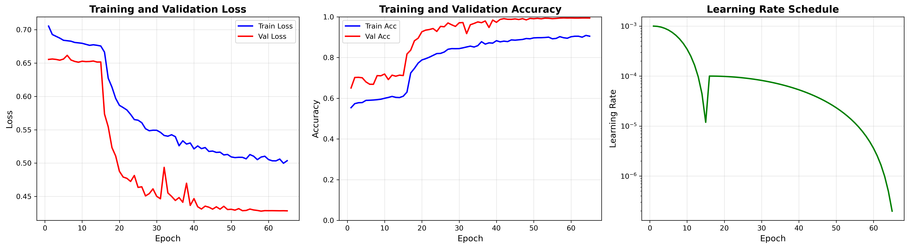
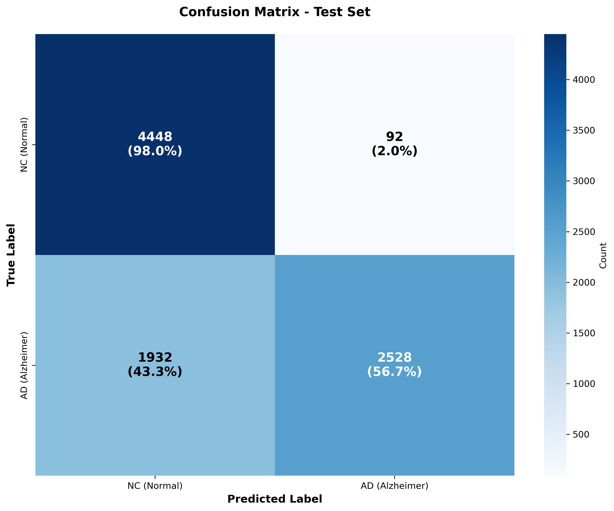
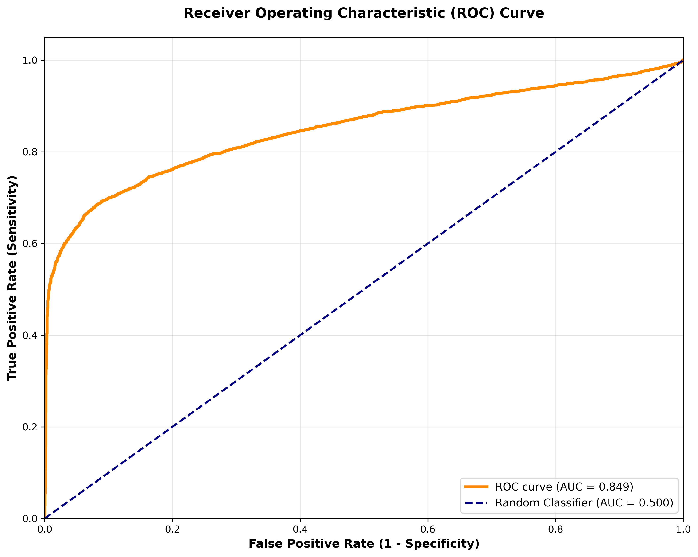
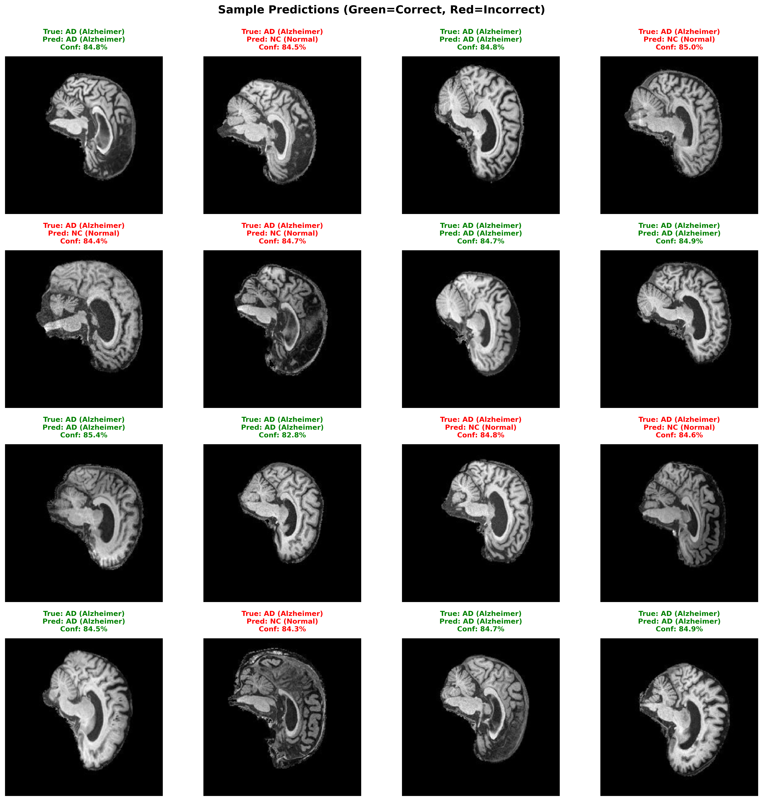

# Alzheimer's Disease Classification with ConvNeXt

Binary classification of brain MRI images to distinguish between Alzheimer's Disease (AD) and Cognitively Normal (NC) patients using ConvNeXt-Small deep learning architecture with transfer learning.

## Problem Description

Alzheimer's Disease is a progressive neurodegenerative disorder and the most common cause of dementia, affecting millions worldwide. Early and accurate diagnosis from brain MRI scans is crucial for treatment planning and patient care.

This project implements an automated classification system using the ADNI (Alzheimer's Disease Neuroimaging Initiative) dataset containing 21,520 training images and 9,000 test images of brain MRI scans. The goal is to classify each scan as either AD (Alzheimer's Disease) or NC (Normal Control).

## Model Architecture

### ConvNeXt-Small

ConvNeXt is a modern CNN architecture that incorporates design principles from Vision Transformers while maintaining the efficiency of traditional CNNs. We use **ConvNeXt-Small** (~50M parameters) pretrained on ImageNet-1K.

**Architecture:**
- Backbone: ConvNeXt-Small feature extractor (pretrained on ImageNet)
- Classifier Head: LayerNorm → Flatten → Dropout (p=0.7) → Linear (768 → 2)

### How It Works

The model uses a **two-stage training strategy**:

**Stage 1: Frozen Backbone Training (15 epochs)**
- Freeze the pretrained ConvNeXt backbone
- Train only the classifier head with LR=1e-3
- Prevents catastrophic forgetting of ImageNet features
- Fast convergence to baseline performance

**Stage 2: Full Fine-Tuning (50 epochs)**  
- Unfreeze all layers
- Fine-tune entire model with LR=1e-4
- Adapts all layers to medical imaging domain
- Early stopping with patience=15

**Key Techniques:**
- **MixUp Augmentation (α=0.4):** Blends pairs of training images and their labels to create virtual training examples, forcing the model to learn more robust features
- **Label Smoothing (ε=0.15):** Softens hard labels from [0,1] to [0.05, 0.95], preventing overconfidence
- **Heavy Data Augmentation:** Geometric and intensity transforms to improve generalization
- **High Dropout (p=0.7):** Strong regularization in classifier head



## Data Preprocessing

### Image Preprocessing
1. Load grayscale brain MRI images (JPEG format)
2. Convert to RGB (3 channels) by channel replication for pretrained model compatibility
3. Resize to 224×224 pixels
4. Normalize using ADNI-specific statistics:
   - Mean: [0.115, 0.115, 0.115]
   - Std: [0.225, 0.225, 0.225]

### Training Augmentation
Strong spatial augmentation to improve robustness across different MRI scanners:
- Random rotation (±30°)
- Random affine transforms (translation, scale 0.75-1.25x, shear)
- Random perspective (distortion=0.2)
- Random resized crop (70-100% of image)
- Random horizontal/vertical flips
- Color jitter (brightness, contrast ±30%)
- Gaussian blur
- Random erasing (p=0.3)
- **MixUp:** Creates virtual training examples by blending image pairs

**Validation/Test Augmentation:**
- Resize to 224×224
- Normalize (no random transforms)

## Train/Validation/Test Split

### Data Distribution
```
Training Data (from train folder):
├── Total: 21,520 images
├── AD: 10,400 (48.3%)
└── NC: 11,120 (51.7%)

Split (80/20 stratified):
├── Training: 17,216 images (48.3% AD, 51.7% NC)
└── Validation: 4,304 images (48.3% AD, 51.7% NC)

Test Data (from test folder - held out):
├── Total: 9,000 images  
├── AD: 4,460 (49.6%)
└── NC: 4,540 (50.4%)
```

### Split Justification - after consult with shakes 

**80/20 Split:**
- Provides sufficient validation data (4,304 samples) for reliable performance estimation
- Maximizes training data (17,216 samples) for learning
- Standard practice in deep learning

**Stratified Sampling:**
- Maintains class balance in both training and validation sets
- Ensures representative evaluation across both classes
- Critical for medical datasets with binary outcomes

**Separate Test Set:**
- Test data completely held out during training
- Never used for model selection or hyperparameter tuning
- Provides unbiased estimate of real-world performance
- Prevents data leakage and overfitting to test distribution

## Results

### Training Performance
- Stage 1 (Frozen): Best validation accuracy **71.91%** at epoch 10
- Stage 2 (Fine-tuning): Best validation accuracy **99.47%** at epoch 43
- Total training time: 117 minutes on NVIDIA A100 GPU

### Test Performance

**Overall Metrics:**
- **Test Accuracy: 77.51%**
- **ROC AUC: 0.849**

**Per-Class Performance:**

| Class | Precision | Recall | F1-Score | Support |
|-------|-----------|--------|----------|---------|
| NC (Normal) | 0.6972 | 0.9797 | 0.8147 | 4,540 |
| AD (Alzheimer) | 0.9649 | 0.5668 | 0.7141 | 4,460 |
| **Accuracy** | | | **0.7751** | **9,000** |

**Confusion Matrix:**



**Key Observations:**
- High NC recall (97.97%) but lower AD recall (56.68%)
- Very high AD precision (96.49%) - when model predicts AD, it's usually correct
- Model exhibits conservative behavior, preferring NC predictions
- 1,932 false negatives (missed AD cases) vs. 92 false positives

### ROC Curve



The ROC curve shows the model's ability to discriminate between AD and NC cases 
across different decision thresholds. The AUC of **0.849** indicates strong 
performance, significantly better than random classification (0.5). This suggests 
the model has good separability between classes - it can rank predictions well 
even though the fixed threshold yields 77.51% accuracy.

### Sample Predictions


The visualization shows 16 random test samples with their predictions. Green text 
indicates correct predictions, red text indicates errors. This particular batch 
shows 7 incorrect predictions (43.75% error rate), and notably, **all 7 errors 
are false negatives** (AD cases predicted as NC) with zero false positives. This 
extreme pattern strongly demonstrates the model's conservative bias toward NC 
predictions, consistent with the confusion matrix showing 1,932 false negatives 
versus only 92 false positives on the full test set.

## Analysis

**Domain Shift:** The significant gap between validation accuracy (99.47%) and test accuracy (77.51%) indicates a distribution shift between training and test sets. This is common in medical imaging where data may originate from different MRI scanners, acquisition protocols, or patient populations.

**Model Behavior:** The model shows a bias toward predicting NC, resulting in high sensitivity for normal cases but lower sensitivity for AD cases. The very high AD precision (96.49%) suggests that when the model does predict AD, it is highly confident and usually correct.

**Strengths:**
- Excellent discriminative ability (AUC 0.849)
- Very low false positive rate (2%)
- Robust methodology with proper data splits

**Limitations:**
- Misses 43% of AD cases (false negatives)
- Domain shift reduces generalization to test distribution
- Conservative prediction bias

## Dependencies

### Required Packages
```
Python >= 3.9
torch >= 2.0.0
torchvision >= 0.15.0
numpy >= 1.24.0
matplotlib >= 3.7.0
seaborn >= 0.12.0
scikit-learn >= 1.3.0
Pillow >= 9.5.0
```

### Development Environment

This project was developed with:
```
Python:        3.9.23
PyTorch:       2.5.1
torchvision:   0.20.1
NumPy:         1.26.4
Matplotlib:    3.9.2
Seaborn:       0.13.2
scikit-learn:  1.6.1
Pillow:        11.3.0
```

### Training Environment (Rangpur HPC)

Training was performed on:
```
GPU:           NVIDIA A100-PCIE-40GB
CUDA:          Available (CUDA 11.8)
Memory:        40GB GPU memory
Training time: ~2 hours (13 min Stage 1 + 103 min Stage 2)
```

### Installation

Install all dependencies:
```bash
pip install torch torchvision numpy matplotlib seaborn scikit-learn Pillow
```

**Note:** CUDA/GPU is required for training but not for running predictions on a pre-trained model.

### File Structure
```
ConvNeXt_Alzheimers_49315271/
├── dataset.py          # Data loading and augmentation
├── modules.py          # Model architecture and loss functions  
├── train.py            # Training script with two-stage approach
├── predict.py          # Evaluation and visualization
└── README.md           # Documentation
```

### Training
```bash
python train.py
```

**Configuration (in train.py):**
- Data path: `/home/groups/comp3710/ADNI/AD_NC`
- Batch size: 32
- Validation split: 20%
- Model: ConvNeXt-Small
- Dropout: 0.7
- MixUp alpha: 0.4
- Label smoothing: 0.15
- Stage 1: 15 epochs, LR=1e-3
- Stage 2: 50 epochs, LR=1e-4

**Outputs:**
- `best_model.pth` - Best model checkpoint (based on validation accuracy)
- `stage1_checkpoint.pth` - Stage 1 checkpoint
- `training_history.png` - Loss and accuracy curves

## Reproducibility

**To reproduce results:**
1. Use random seed: 42
2. Apply same 80/20 stratified split
3. Use ADNI normalization: mean=[0.115, 0.115, 0.115], std=[0.225, 0.225, 0.225]
4. Train with specified hyperparameters
5. Trained on Rangpur with NVIDIA A100 GPU with CUDA support

**Note:** Results may vary slightly (±1-2%) due to GPU/hardware differences and PyTorch non-determinism.

## AI Acknowledgement

This project was developed with assistance from AI tools (Claude by Anthropic) in accordance with course policy. AI was used for:
- Learning PyTorch and deep learning best practices
- Code structure and documentation guidance (polish grammar for clarity)
- Debugging assistance and methodology discussion

All design decisions, implementation, training, analysis are the my decision, AI was used as a learning assistant, not a replacement for understanding.
## Author

Name: Jim Hern Tan / Student ID: 49315271
Course: COMP3710 Pattern Recognition and Analysis  